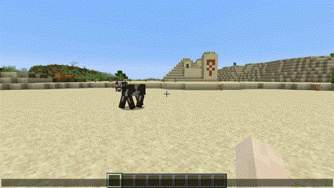

# CommandLib - A Feature-Rich Minecraft Command API for Bukkit

[](https://jitpack.io/#TeamKun/CommandLib)

CommandLib is an advanced, type-safe Command API for Bukkit(Spigot/Paper) developers. It abstracts and enhances the
Minecraft 1.13
command APIs, simplifying command implementation. With features like customizable argument suggestions, seamless
validation, improved usability, and extensibility, CommandLib empowers developers to build better commands with ease.

#### Supported Versions

| Platform                 | Tested Versions                                            | Notes                                              |
|--------------------------|------------------------------------------------------------|----------------------------------------------------|
| **Bukkit(Spigot/Paper)** | `1.16.5`, `1.19.4`, `1.20.1`, `1.20.4`, `1.20.6`, `1.21.0` | Expected to work on intermediate versions.         |
| **Forge**                | `1.16.5`                                                   | Currently supports only `1.16.5` and works fully.  |
| **Mohist**               | `1.16.5`, `1.20.1`                                         | Works on Mohist since it's compatible with Spigot. |

## Features

1. **Type-Safe Arguments Handling**  
   Use arguments in a type-safe manner directly within your code, reducing potential runtime errors and improving
   maintainability.
2. **No Need for Brigadier and NMS Dependency**  
   Simplify your setup and ensure compatibility across multiple Minecraft versions.
3. **Powerful Suggestion Generation**  
   Automatically generate argument suggestions with customizable options for enhanced flexibility.
4. **Seamless Integration with the `/execute` command**   
   Allow your commands to be executed seamlessly from the `/execute` command, just like built-in commands.  
   

## Installation

To ensure stability, we recommend replacing `latest.release` with a specific version such as `0.16.0`.  
You can find the latest version on the [releases page](https://github.com/TeamKun/CommandLib/releases).

<details>
<summary>Bukkit</summary>

```groovy
plugins {
    id "com.gradleup.shadow" version "8.3.5"
}

repositories {
    maven { url 'https://jitpack.io' }
}

dependencies {
    implementation "com.github.TeamKun.CommandLib:bukkit:latest.release"
}

shadowJar {
    archiveFileName = "${rootProject.name}-${project.version}.jar"
    // Avoid package conflicts
    relocate "net.kunmc.lab.commandlib", "${project.group}.${project.name.toLowerCase()}.commandlib"
}
tasks.build.dependsOn tasks.shadowJar
```

</details>

<details>
<summary>Forge</summary>

```groovy
plugins {
    id "com.gradleup.shadow" version "8.3.5"
}

repositories {
    maven { url 'https://jitpack.io' }
}

dependencies {
    implementation "com.github.TeamKun.CommandLib:forge:latest.release"
}

shadowJar {
    archiveFileName = "${rootProject.name}-${project.version}.jar"
    dependencies {
        include(dependency("com.github.TeamKun.CommandLib:forge:.*"))
    }
    // Avoid package conflicts
    relocate "net.kunmc.lab.commandlib", "${project.group}.${project.name.toLowerCase()}.commandlib"
    finalizedBy("reobfShadowJar")
}

reobf {
    shadowJar {
    }
}
```

</details>

## Code Examples

<details>
<summary>Defining Commands</summary>

```java
public final class TestPlugin extends JavaPlugin {
    public void onEnable() {
        CommandLib.register(this, new Command("message") {{
            argument(new PlayerArgument("target"), new StringArgument("message"), (target, message, ctx) -> {
                // 'target' is inferred as 'org.bukkit.entity.Player'. No need to cast.
                target.sendMessage(message);
            });
        }});
    }
}
```

```java
// Also you can define commands by extending Command
public final class MessageCommand extends Command {
    public MessageCommand() {
        super("message");
        argument(new PlayerArgument("target"), new StringArgument("message"), (target, message, ctx) -> {
            target.sendMessage(message);
        });
    }
}

public final class TestPlugin extends JavaPlugin {
    public void onEnable() {
        CommandLib.register(this, new MessageCommand());
    }
}
```

</details>

<details>
<summary>Appending Subcommands</summary>

```java
public final class TestPlugin extends JavaPlugin {
    public void onEnable() {
        CommandLib.register(this, new Command("game") {{
            addChildren(new Command("start") {{
                execute(ctx -> {
                    // Starts game
                });
            }}, new Command("stop") {{
                execute(ctx -> {
                    // Stops game
                });
            }});
        }});
    }
}
```

</details>


<details>
<summary>Suggesting Block Materials</summary>

```java
public final class TestPlugin extends JavaPlugin {
    public void onEnable() {
        CommandLib.register(this, new Command("test") {{
            argument(new EnumArgument<>("block", Material.class, option -> {
                option.filter(x -> {
                    if (!x.isBlock()) {
                        // Displays an error message to the sender if the argument is not a block material.
                        throw new InvalidArgumentException(x.name() + " is not block.");
                    }
                });
            }), (m, ctx) -> {
                // Do something
            });
        }});
    }
}
```

</details>

<details>
<summary>Defining Variable Length Arguments</summary>

```java
public final class TestPlugin extends JavaPlugin {
    public void onEnable() {
        CommandLib.register(this, new Command("test") {{
            argument(new PlayerArgument("player"), (player, ctx) -> {
                // Do something
            });
            argument(new PlayerArgument("player"), new StringArgument("message"), (player, message, ctx) -> {
                // Do something
            });
        }});
    }
}
```

</details>

## Permissions (Bukkit)

CommandLib automatically generates and registers Bukkit permission nodes for each command.

### Permission Prefix

By default, permission nodes are generated as `minecraft.command.<name>`.  
Pass a custom prefix to `CommandLib.register()` to use your own namespace:

```java
// Generates "myplugin.command.spawn", "myplugin.command.game.start", etc.
CommandLib.register(this, "myplugin.command", new SpawnCommand(), new GameCommand());
```

The prefix is applied to all commands and their subcommands recursively.

### Custom Permission Node

To assign a specific permission node to a command instead of the auto-generated one:

```java
public final class SpawnCommand extends Command {
    public SpawnCommand() {
        super("spawn");
        permission("myplugin.admin");           // fixed node, ignores prefix
        permission("myplugin.admin", PermissionDefault.FALSE); // with default
    }
}
```

### Permission Default

Control who has the permission by default:

```java
permission(PermissionDefault.OP);    // default — only operators
permission(PermissionDefault.TRUE);  // everyone
permission(PermissionDefault.FALSE); // no one (must be granted explicitly)
```

### LuckPerms Compatibility

CommandLib uses Bukkit's standard `sender.hasPermission()` for all permission checks.  
LuckPerms integrates with Bukkit's permission system, so **no additional configuration is needed** — LuckPerms permissions work out of the box.

## Sample Projects

[Bukkit](./sample/bukkit)  
[Forge](./sample/forge)
